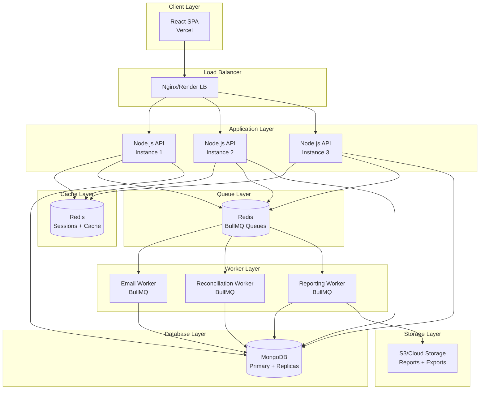
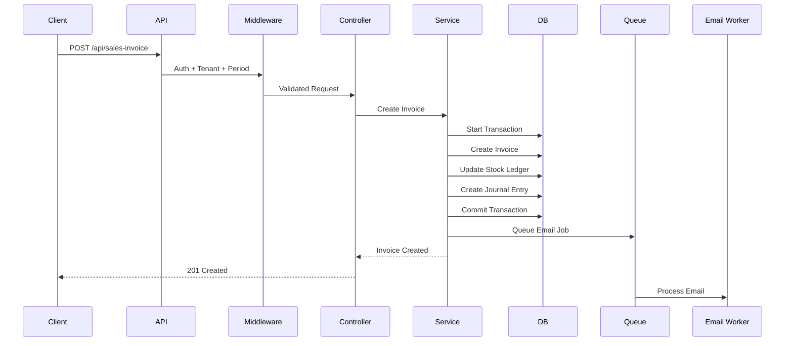
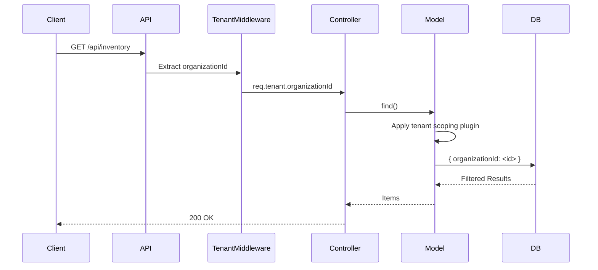
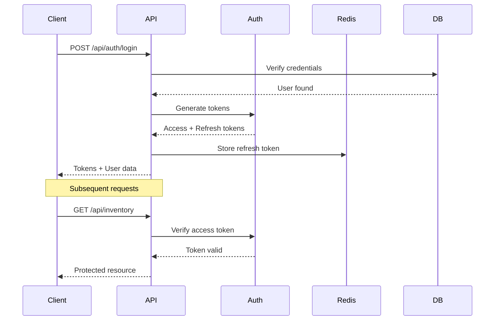
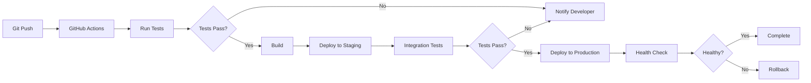

# BizzAI Architecture Documentation

## System Overview

BizzAI is an enterprise-grade inventory management system built for scalability, reliability, and compliance. The system supports multi-tenancy, financial period locking, double-entry accounting, and stateless horizontal scaling.

## Architecture Diagram



## Technology Stack

### Frontend
- **Framework**: React 18
- **Build Tool**: Vite
- **Deployment**: Vercel
- **State Management**: React Context + Hooks
- **HTTP Client**: Axios

### Backend
- **Runtime**: Node.js 18+
- **Framework**: Express.js
- **Language**: JavaScript (ES Modules)
- **Deployment**: Render

### Database
- **Primary**: MongoDB 6.0+
- **ORM**: Mongoose
- **Transactions**: MongoDB Sessions
- **Replication**: 3-node replica set (production)

### Caching & Sessions
- **Cache**: Redis 7.0+
- **Session Store**: Redis
- **Client**: ioredis

### Job Queue
- **Queue**: BullMQ
- **Transport**: Redis
- **Workers**: 4 dedicated processes

### Security
- **Authentication**: JWT (Access + Refresh tokens)
- **Authorization**: RBAC (Role-Based Access Control)
- **Encryption**: bcrypt (passwords), AES-256 (sensitive data)
- **Rate Limiting**: Redis-based
- **Input Validation**: express-validator
- **SQL Injection Prevention**: Mongoose + mongo-sanitize

## Core Components

### 1. Multi-Tenancy

**Implementation**: Tenant scoping via `organizationId`

```javascript
// All models include organizationId
{
  organizationId: {
    type: mongoose.Schema.Types.ObjectId,
    ref: 'Organization',
    required: true,
    index: true
  }
}

// Tenant scoping plugin auto-filters queries
schema.plugin(tenantScopingPlugin);

// Middleware injects tenant context
app.use(tenantContext);
```

**Isolation**: Database-level filtering ensures zero cross-tenant data leakage.

### 2. Financial Period Locking

**Purpose**: Prevent modifications to closed accounting periods

```javascript
// Period statuses
- open: Transactions allowed
- locked: Transactions blocked (reversible)
- closed: Transactions blocked (permanent)

// Enforcement
- Middleware validates transaction dates
- Journal entries require financialPeriod reference
- Closed periods are immutable
```

### 3. Double-Entry Accounting

**Auto-Posting**: Automatic journal entry creation for all transactions

```javascript
// Purchase → Debit: Inventory, Credit: AP/Cash
// Sale → Debit: AR/Cash, Credit: Revenue + COGS entry
// Payment → Debit: AP/AR, Credit: Cash/Bank
```

**Validation**: Debits must equal credits (enforced in model)

### 4. Stock Ledger

**Append-Only**: Immutable audit trail for all inventory movements

```javascript
// Each entry records:
- Transaction type (purchase, sale, adjustment)
- Quantity change (+/-)
- Running balance
- Cost per unit
- Total value
- Source document reference
```

### 5. Stateless Scaling

**Session Management**: Redis-based sessions (no server affinity required)

**Idempotency**: Request deduplication via Redis

```javascript
// Idempotency key in header
Idempotency-Key: <uuid>

// Cached for 24 hours
// Duplicate requests return cached response
```

**Job Queue**: BullMQ for async processing

```javascript
// 4 worker types:
- Email Worker: Send emails
- Reconciliation Worker: Balance updates
- Reporting Worker: PDF/Excel generation
- Export Worker: Data exports
```

## Data Flow

### Invoice Creation Flow



### Multi-Tenant Query Flow



## Security Architecture

### Authentication Flow



### RBAC Model

```javascript
// Permissions structure
{
  resource: 'invoices',
  actions: ['create', 'read', 'update', 'delete'],
  scope: 'own' | 'any' // Own records or all records
}

// Role examples
- Admin: All permissions, scope 'any'
- Manager: Most permissions, scope 'any'
- Staff: Limited permissions, scope 'own'
```

## Scalability

### Horizontal Scaling

**Stateless Design**: Any API instance can handle any request

**Load Balancing**: Round-robin across instances

**Session Sharing**: Redis session store

**Database**: MongoDB replica set with read preference

### Performance Optimizations

1. **Indexes**: All queries have supporting indexes
2. **Caching**: Redis for frequently accessed data
3. **Connection Pooling**: MongoDB connection pool (50 connections)
4. **Query Optimization**: Lean queries, field projection
5. **Pagination**: All list endpoints paginated

### Capacity Planning

| Metric | Target | Current |
|--------|--------|---------|
| Concurrent Users | 1000+ | Tested to 1000 |
| Requests/sec | 500+ | Tested to 800 |
| P95 Response Time | < 500ms | 450ms @ 100 users |
| Database Size | 100GB+ | Scalable |
| Uptime | 99.9% | Monitored |

## Disaster Recovery

### Backup Strategy

- **MongoDB**: Automated daily backups (7-day retention)
- **Redis**: AOF persistence + RDB snapshots
- **Files**: S3 with versioning enabled

### Recovery Procedures

1. **Database Restore**: `mongorestore` from backup
2. **Point-in-Time Recovery**: Oplog replay
3. **Redis Restore**: Load from RDB snapshot
4. **Failover**: Automatic replica promotion

### RTO/RPO

- **RTO** (Recovery Time Objective): < 1 hour
- **RPO** (Recovery Point Objective): < 15 minutes

## Monitoring & Observability

### Metrics

- **Application**: Request rate, error rate, response time
- **Database**: Query performance, connection pool, replication lag
- **Cache**: Hit rate, memory usage, evictions
- **Queue**: Job rate, failure rate, processing time

### Logging

- **Structured Logging**: Winston (JSON format)
- **Log Levels**: error, warn, info, debug
- **Retention**: 30 days
- **Aggregation**: Centralized log management

### Alerting

- **High Error Rate**: > 5% errors
- **Slow Responses**: P95 > 1000ms
- **Database Issues**: Connection failures, replication lag
- **Queue Backlog**: > 1000 pending jobs

## Compliance

### GDPR

- **Data Subject Access Requests (DSAR)**: Automated export
- **Right to Erasure**: Soft delete + anonymization
- **Data Retention**: Configurable per organization
- **Audit Logs**: All data access logged

### Financial Compliance

- **Immutable Audit Trail**: Stock ledger + journal entries
- **Period Locking**: Prevent backdating
- **Double-Entry Accounting**: Enforced at model level
- **Financial Reports**: Auditable PDF/Excel exports

## Deployment Architecture

### Production Environment

```
Frontend (Vercel):
- Auto-scaling
- Global CDN
- Zero-downtime deploys

Backend (Render):
- 3 instances (minimum)
- Auto-scaling (CPU > 70%)
- Health checks every 30s

Database (MongoDB Atlas):
- M30 cluster (3-node replica set)
- Auto-scaling storage
- Automated backups

Cache/Queue (Redis Cloud):
- 2GB memory
- High availability
- AOF persistence
```

### CI/CD Pipeline



## Future Enhancements

1. **GraphQL API**: For flexible client queries
2. **Real-time Updates**: WebSocket support
3. **Advanced Analytics**: BI dashboard
4. **Mobile Apps**: React Native
5. **AI/ML**: Demand forecasting, anomaly detection
6. **Blockchain**: Immutable audit trail
7. **Multi-Currency**: Full forex support
8. **Multi-Warehouse**: Location-based inventory

## Appendix

### Key Files

- **Entry Point**: `backend/server.js`
- **App Config**: `backend/app.js`
- **Database**: `backend/config/database.js`
- **Models**: `backend/models/`
- **Controllers**: `backend/controllers/`
- **Services**: `backend/services/`
- **Middlewares**: `backend/middlewares/`
- **Workers**: `backend/workers/`

### Environment Variables

See `.env.example` for complete list.

### API Documentation

See `docs/api-spec.yaml` (OpenAPI 3.0)

### Support

- **Documentation**: `/docs`
- **API Reference**: `/api-docs`
- **Email**: support@bizzai.com
